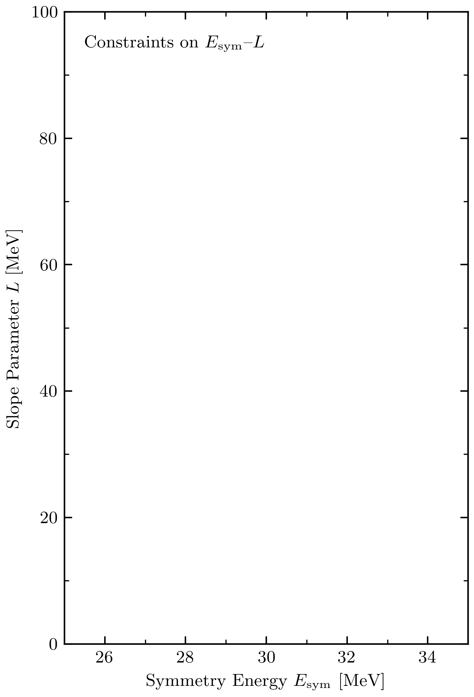

# Bayesian Uncertainty Quantification of the Infinite Nuclear Matter Equation of State


This repository contains the data and Jupyter notebooks to produce the figures
in our publications:

* *How well do we know the neutron-matter equation of state at the densities inside neutron stars? A Bayesian approach with correlated uncertainties*, [arXiv:2004.07232](https://arxiv.org/abs/2004.07232).
* *Quantifying uncertainties and correlations in the nuclear-matter equation of state*, [arXiv:2004.07805](https://arxiv.org/abs/2004.07805).


## Overview

This repository is organized as follows: The directory `analysis` contains
all the relevant Jupyter notebooks:
* `3BF_convergence.ipynb`: (add brief description or just keywords)
* `derivatives-bands.ipynb`: (add brief description or just keywords)
* `saturation_analysis.ipynb`: (add brief description or just keywords)
* `derivatives.ipynb`: (add brief description or just keywords)
* `symmetry_energy_input_space.ipynb`: (add brief description or just keywords)
* `correlated_matter_analysis_refactored.ipynb`: (add brief description or just keywords)
* `make_LaTeX_table.ipynb`: (add brief description or just keywords)


The directories `nuclear_matter`and `other_figures`contain the raw Python
implementation, helper functions, etc. and additional figures not shown in the
papers (e.g., for talks), respectively. The raw data for the equation of state of
neutron matter and symmetric nuclear matter can be found in `data` and
`raw_data`.


## Requirements and Installations

Installing and running our Jupyter notebooks is straightforward. `Python3` is
required with the standard packages listed in `requirements.txt` installed. In
addition, J. Melendez's package `gsum`, which is publicly available [here](gsum)
including installation instructions, needs to be installed separately.

With these prerequisites, to install this repository simply run (at the top level):

```shell
pip install .
```

## Symmetry Energy and its Slope Parameter

BUQEYE's version of J. Lattimer's well-known `Sv--L plot`, Figure 2 of our [arXiv:2004.07232](https://arxiv.org/abs/2004.07232), can be produced using the Jupyter Notebook `analysis/Esym-L/Esym_L_correlation_plot.ipynb`. In addition to
a static `pdf` file, we support the export of an animated `gif`, which shows the different empirical constraints incrementally. This is, in particular, useful for scientific talks and teaching.

<p align="center">
  
</p>


## Contact

To report any issues please use the issue tracker.


## Citing this Work and Further Reading

* Drischler, Furnstahl, Melendez, and Phillips, _How well do we know the neutron-matter equation of state at the densities
inside neutron stars? A Bayesian approach with correlated uncertainties_, [arXiv:2004.07232](https://arxiv.org/abs/2004.07232)

* Drischler, Melendez, Furnstahl, and Phillips, _Effective
Field Theory Convergence Pattern of Infinite Nuclear Matter_, [arXiv:2004.07805](https://arxiv.org/abs/2004.07805)


[buqeye]:https://buqeye.github.io/ "to the website of the BUQEYE collaboration"
[gsum]:https://github.com/buqeye/gsum "to the gsum's github repository"
[shortPaper]: https://buqeye.github.io/
[longPaper]: https://buqeye.github.io/
