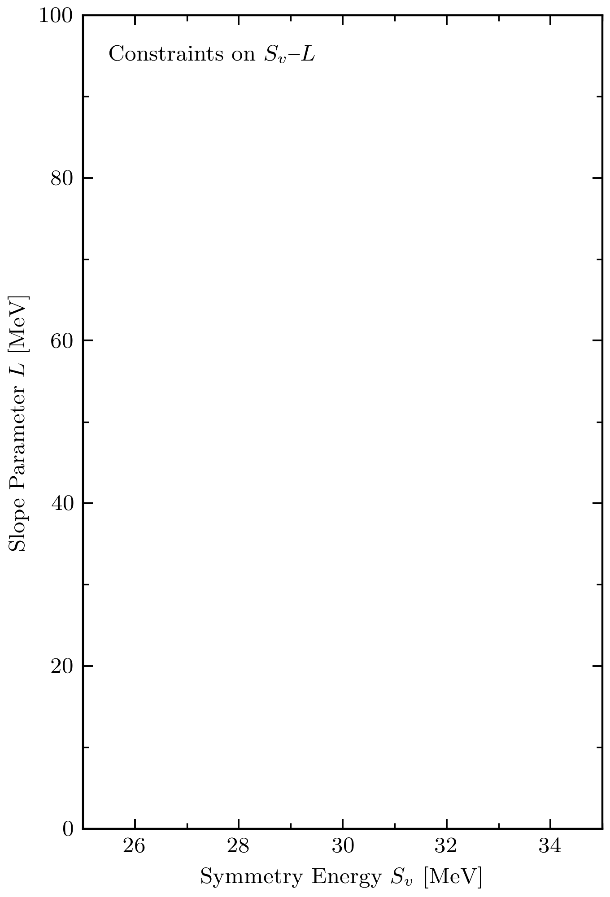

# Symmetry Energy and its Slope Parameter

BUQEYE's version of J. Lattimer's well-known `Sv--L plot`, Figure 2 of our
[arXiv:2004.07232](https://arxiv.org/abs/2004.07232), can be produced using the
Jupyter Notebook `Esym_L_correlation_plot.ipynb`. In addition to
a static `pdf` file, we support the export of an animated `gif`, which shows the
different empirical constraints incrementally. This is, in particular, useful
for scientific talks and teaching. The underlying data is located in `data`.

  

## Citing this Work and Further Reading

* Drischler, Furnstahl, Melendez, and Phillips, _How well do we know the neutron-matter equation of state at the densities
inside neutron stars? A Bayesian approach with correlated uncertainties_, [arXiv:2004.07232](https://arxiv.org/abs/2004.07232).

[buqeye]:https://buqeye.github.io/ "to the website of the BUQEYE collaboration"
[gsum]:https://github.com/buqeye/gsum "to the gsum's github repository"
[shortPaper]: https://buqeye.github.io/
[longPaper]: https://buqeye.github.io/
